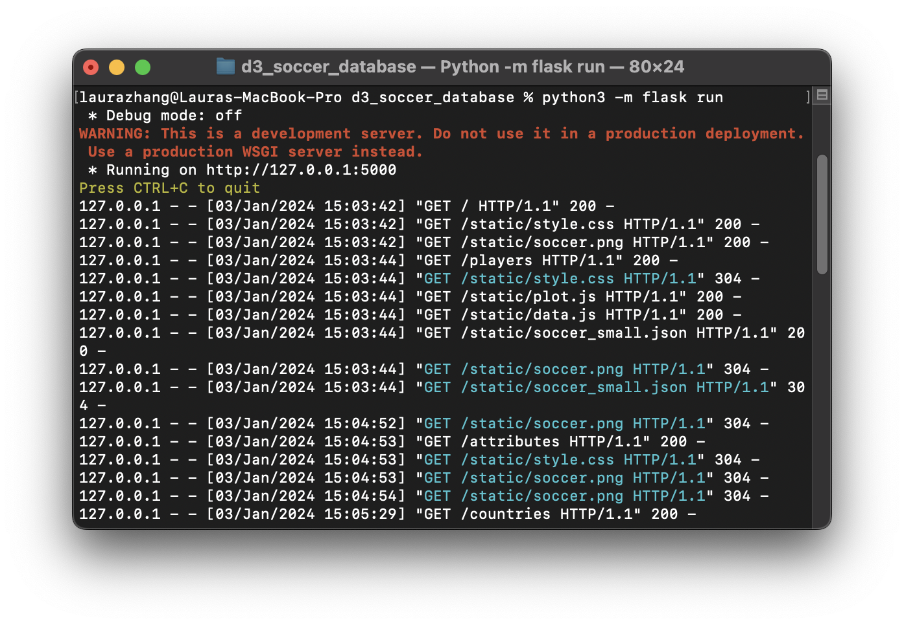
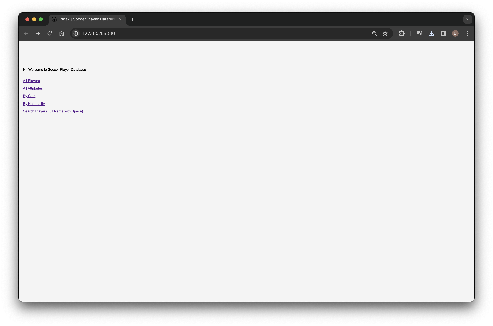
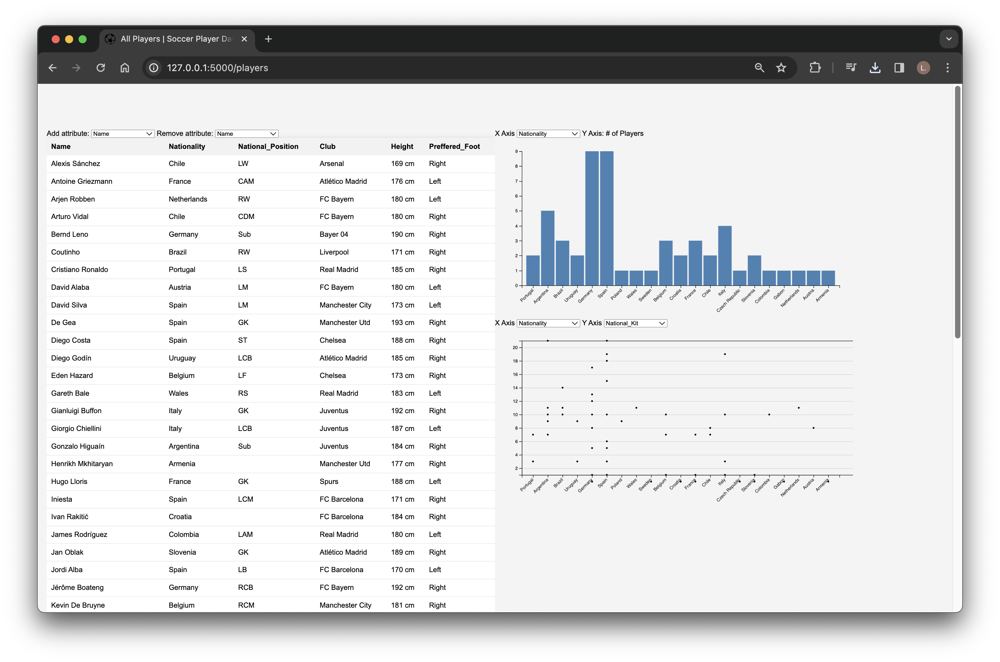
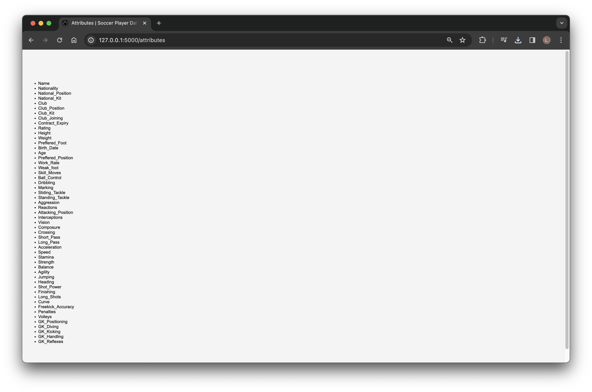
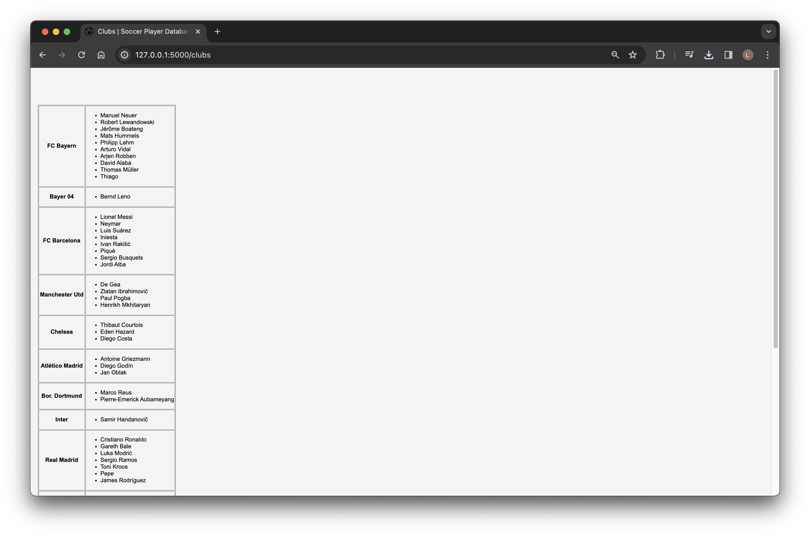
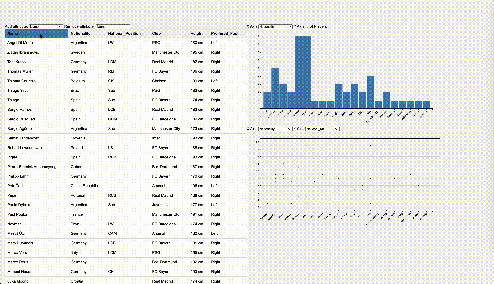
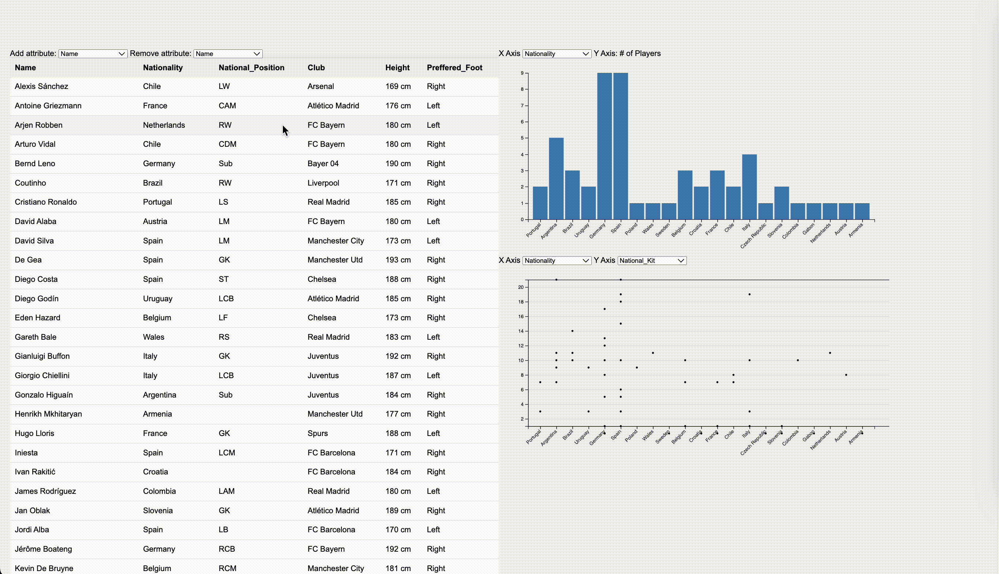

# Soccer Player Database
#### Laura Zhang
## Overview

This is a Flask application to serve player information through REST API endpoints. The frontend is developed using D3 that showcases soccer player details as table, bar chart and dot plot.

## How to Run the Application
### Installation
```shell
$ pip install flask
$ pip install json2html
$ pip install -r requirements.txt
```
### Running Flask Server
```shell
$ python3 -m flask run
```
### Pages
Index: `http://127.0.0.1:5000`

All players: `http://127.0.0.1:5000/players`

List of all attribute names: `http://127.0.0.1:5000/attributes`

Clubs with their players: `http://127.0.0.1:5000/clubs`

Countries with their players: `http://127.0.0.1:5000/countries`

Individual player details: `http://127.0.0.1:5000/players/{name}`

## Application Structure
```
└── d3_soccer_database
    ├── templates/
    │   ├── data.html
    │   ├── index.html
    │   └── query.html
    ├── static/
    │   ├── data.js
    │   ├── plot.js
    │   ├── soccer.png
    │   ├── soccer_small.json
    │   └── style.css
    ├── app.py
    ├── README.md
    └── requirements.txt
```
## Screenshots
### Terminal

### Index

### All Players

### List of All Attribute Names

### Clubs with Their Players

### Countries with Their Players

### Individual Player Details

## Demos
### Sorting When Clicking on Column Headers

### Dropdown for Attribute Manipulation

### Bar Chart

### Dot Plot

### Table-Chart Interaction
