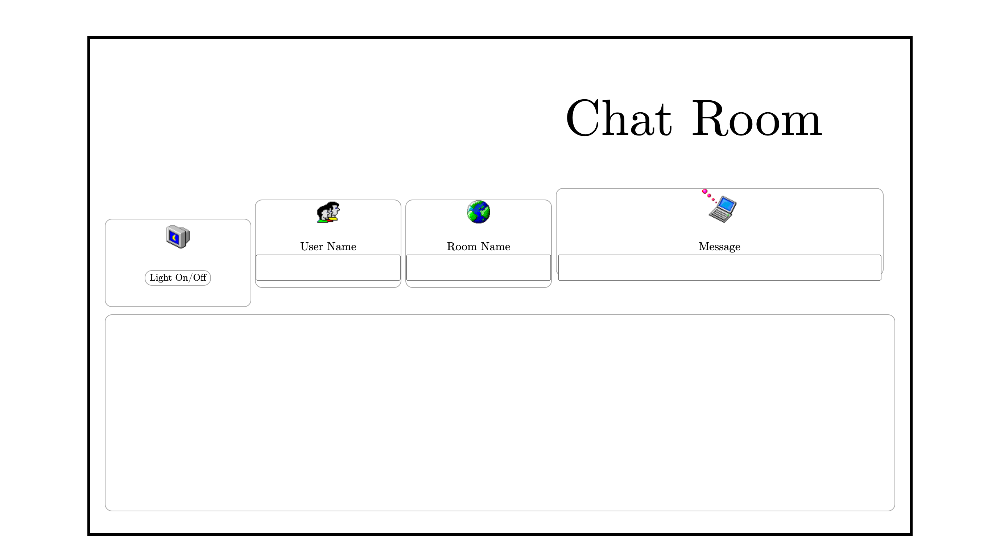
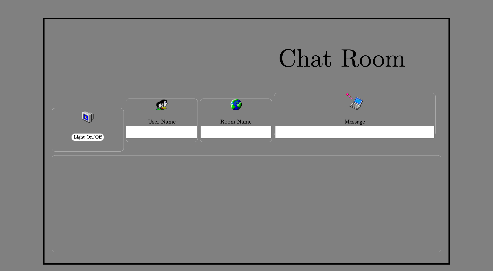

# ChatRoom

#### Muyuan Zhang

## Features

* Developed a Web & Android chat application using Kotlin and built a multithreaded HTTP/Web socket local server with Java and formatted messages in JSON.
* Implemented the client-side Web UI with JavaScript, HTML and CSS.

## Screenshot

### Light On

### Light Off

